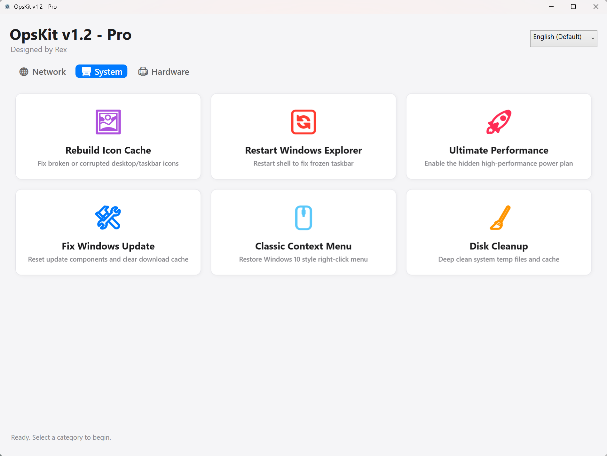
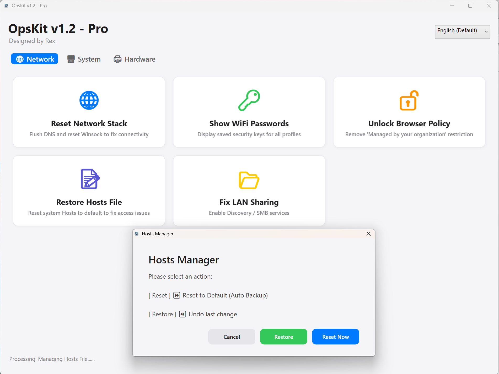
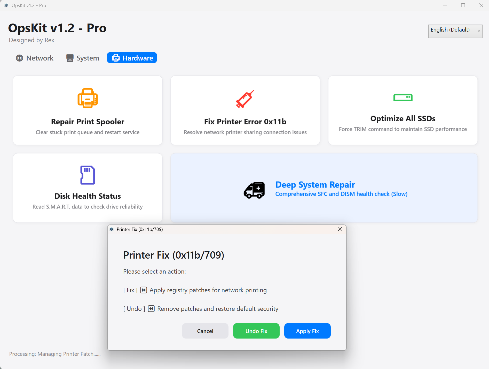
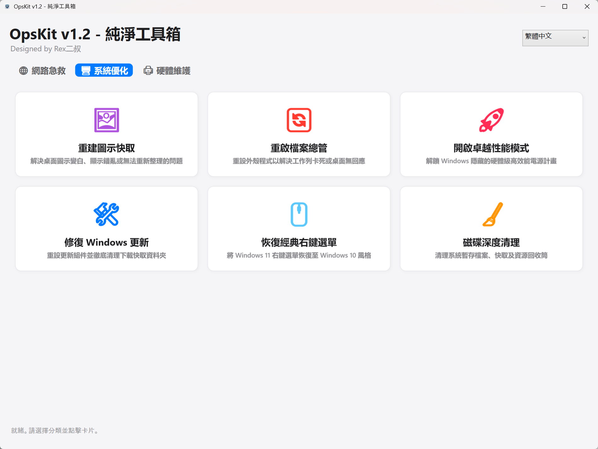

🛠️ OpsKit v1.2 by Rex

OpsKit is a professional, lightweight, and stateless system maintenance toolkit.
It is packaged as a single executable (.exe) with zero dependencies and leaves no configuration files behind. Perfect for your USB toolkit.

OpsKit 是一款轻量级、无状态系统维护工具箱。它以单文件形式发布，零依赖、零残留，完美适用于 USB 随身携带。
---------------------------------------------------
✨ Why OpsKit? (为什么选择 OpsKit?)
OpsKit bridges the gap between professional command-line tools and everyday users.
OpsKit 填补了专业命令行工具与普通用户之间的鸿沟。

For Beginners (小白友好): No complex commands or scripts. If your WiFi is down or printer fails, just find the matching icon and click "Fix".

零门槛：无需懂代码或复杂的 CMD 命令。遇到断网、打印机报错？找到对应图标，点击即修。

  

Instant Diagnosis (快速诊断): Not sure if your hard drive is dying? The "Disk Health" and "WiFi Password" tools give you instant answers without technical jargon.

直观判断：硬盘卡顿？想看 WiFi 密码？通过可视化的健康检查功能，一秒判断故障源头，拒绝盲目重装系统。

Visual Feedback (视觉反馈): Clear status icons (NVMe/HDD/Network) help you identify hardware types and system states at a glance.

所见即所得：让你一眼看懂当前操作的是 SSD 还是机械硬盘，操作更安心。

---------------------------------------------------
✨ Key Features (核心功能)
Powered strictly by native Windows APIs. Safe, Standard, and Secure.
(本工具仅使用 Windows 原生 API 与命令，安全、标准、可靠。)

OpsKit organizes 16 essential utilities into three professional categories.
OpsKit 将 16 个核心功能整合为三个专业类别：

🖥️ System (系统与优化)
Focus on functionality restoration and performance.  

Rebuild Icon Cache,"Fix broken, white, or corrupted icons on the Desktop and Taskbar."  

Restart Explorer,Restart the Windows Shell (Explorer.exe) to fix a frozen taskbar or desktop.  

Ultimate Performance,"Unlock and enable the hidden ""Ultimate Performance"" power plan for high-end hardware."  

Fix Windows Update,Reset Windows Update components and clear the software distribution cache.  

Classic Context Menu,Restore the classic Windows 10 style right-click menu on Windows 11.  

Disk Cleanup,"Deep clean system temporary files, cache, and recycle bin to free up disk space."  

  

🌐 Network (网络与连接)
Focus on connectivity reset and recovery.  

Reset Network Stack,Flush DNS cache and reset Winsock catalog to fix complex connectivity issues.  

Show WiFi Passwords,Instantly retrieve and display saved security keys for all wireless profiles.  

Unlock Browser Policy,"Remove ""Managed by your organization"" restrictions hijacked by malware or policies."  

Restore Hosts File,Reset the system hosts file to default to fix website access or redirection issues.  

Fix LAN Sharing,One-click enable Network Discovery and SMB services for LAN file sharing.  

  

🖨️ Hardware (硬件与外设)
Focus on deep maintenance and repair.  

Repair Print SpoolerClear stuck print queues and restart the Spooler service instantly.  

Fix Error 0x11b / 709Apply registry fixes for network printer sharing errors (RPC/SMB issues).  

Optimize All SSDsForce TRIM commands on all detected NVMe/SATA SSDs to maintain speed.  

Disk Health StatusRead S.M.A.R.T. data to evaluate the physical reliability of your drives.  

Deep System RepairInitiate a comprehensive system file check using SFC and DISM (Time-consuming).  

  

---------------------------------------------------
🌍 Global Language Support (多语言支持)
OpsKit v1.0 Pro features an Intelligent Language Engine. It automatically detects your system UI language upon launch.  

OpsKit 内置智能语言引擎，启动时自动识别当前系统语言，无需手动设置。

🇺🇸 English (Default)
🇨🇳 简体中文 (Simplified Chinese)
🇹🇼 繁體中文 (Traditional Chinese - Taiwan/Hong Kong)
🇯🇵 日本語 (Japanese - Professional IT Terminology)
🇫🇷 Français (French)
🇩🇪 Deutsch (German)
🇪🇸 Español (Spanish)

  

---------------------------------------------------
🚀 How to Use (使用方法)
Download the latest OpsKit.zip from Releases and Upzip.  

Run OpsKit.exe as Administrator (Right-click -> Run as Administrator).  

Note: Admin privileges are required for system modifications.  

Plug & Play: No installation required. You can run it directly from a USB drive.  

---------------------------------------------------
🎨 Design Philosophy (设计理念)
Stateless (无状态): OpsKit does not generate config files (.json, .ini) or registry keys. It keeps your file system clean.

## 🛡️ Pure & Native (纯净与原生)
OpsKit follows the philosophy of **"Simplicity out of Complexity"**.  

OpsKit 遵循**“化繁为简”**的设计哲学。

* **100% Native Windows Commands (全原生命令)**:
    Every button triggers standard, transparent Windows operations (e.g., `netsh`, `ipconfig`, `PowerShell`, `Reg.exe`, `WMI`).
    > **原生操作**：所有功能均调用 Windows 自身命令。是将繁琐的手动步骤封装为一键自动化，本质上与你手动输入的一样安全。

* **Zero Third-Party Dependencies (零第三方依赖)**:
    No `nircmd.exe`, no `psexec`, no unknown DLLs. The tool is purely built on the .NET framework already present in your OS.
    > **拒绝第三方**：不包含任何非微软官方的第三方 EXE 或 DLL 文件。没有黑盒，只有透明的标准系统调用。

* **Transparency (透明化)**:
    What you see is what you execute. We believe the best tool is the one that respects the operating system's original logic.
    > **逻辑透明**：我们不创造“魔法”，只是将系统原本复杂的维护逻辑变得触手可及。

Native UI: Built with WPF/XAML for a clean, responsive interface that scales perfectly on 1080p+ screens.
Vector Icons: Uses Windows native Segoe MDL2 Assets for crisp rendering at any DPI.

---------------------------------------------------
⚠️ Disclaimer (免责声明)
This tool makes changes to system configurations (Registry, Services, Files). While tested thoroughly, please use it with caution.
本工具会修改系统配置（注册表、服务、文件）。虽然经过充分测试，但请谨慎使用，建议在操作前备份重要数据。

Use at your own risk. The author is not responsible for any data loss or system instability.
Certain antivirus software might flag the .exe due to its ability to modify system settings (False Positive).

---------------------------------------------------
📄 License
This project is licensed under the MIT License - see the LICENSE file for details.

